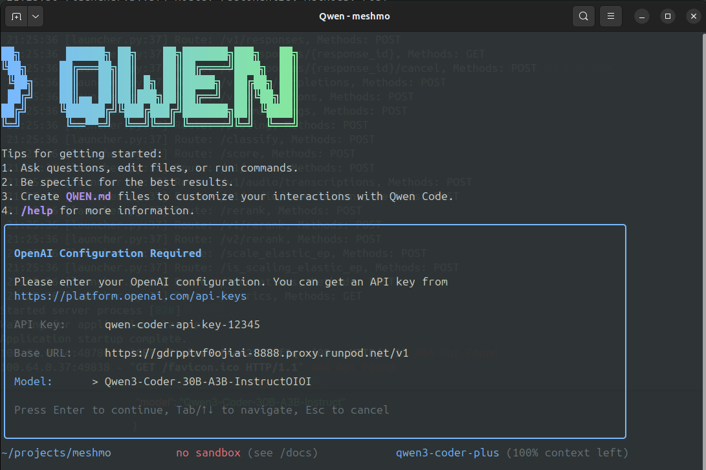

# Qwen3-Coder Self-Hosting Setup

Quick deployment scripts for running Qwen3-Coder-30B-A3B-Instruct on cloud GPU infrastructure with persistent storage on Runpod.

## Overview

This setup creates a mountable network drive that allows you to:
- Spin up a GPU server on-demand
- Mount your persistent drive
- Start Qwen3-Coder with a single command
- Terminate the server when done (pay only for usage)

Initial setup takes longest, but subsequent startups are just a few minutes.

## Requirements

### Storage
- **100GB** persistent drive space

### GPU Requirements
- **80GB vRAM** minimum for 141k context window
- **A100 80GB** - tested and working
- Model supports up to 1M context (requires higher-end setup)

### Recommended Base Image
```
runpod/pytorch:2.8.0-py3.11-cuda12.8.1-cudnn-devel-ubuntu22.04
```
*Note: Uses port 8888 (Jupyter gets terminated automatically to free the port)*

## Quick Start

### 1. Initial Environment Setup
```bash
sh setup_qwen_initial_environment.sh
```
Creates Python virtual environment and installs dependencies. Persisted on your mountable drive for future use.

### 2. Download Model
```bash
sh download_Qwen3-Coder-30B-A3B-Instruct.sh
```
Downloads ~60GB model files. This will take a while. It will also persist so is a one time setup.

### 3. System Check (Optional)
```bash
sh system_checker.sh
```
Validates your environment has everything needed to run the model.

### 4. Start Qwen API Server
For single A100 GPU 
```bash
sh A100_start_qwen_server.sh
```


For RTX A5000 GPU (4 GPU setup)
```bash
sh RTXA5000_start_qwen_server.sh
```


Loads model weights and serves on port 8888 with tool calling support.

## Cost Analysis

| GPU Type | vRAM | Hourly Cost* | Performance |
|----------|------|-------------|-------------|
| A100 | 80GB | $1.70/hr | ✅ Tested (fast startup, good performance)|
| 4x RTX A5000  | 96GB | $1.08/hr | ✅ Tested (slow startup, good performance)|


*Prices at the time of writing this 08/25

## Usage Notes

- Server runs on port 8888
- Compatible with OpenAI API format
- Includes custom tool parser for enhanced functionality
- Persistent storage means faster subsequent deployments
- Model supports extended context windows (up to 1M tokens with appropriate hardware)

## Next Steps

After setup, the model will be accessible via API calls on the base url of your runpod pod (what was formerly the jupyter notebooks link with /v1 at the end). See the [Qwen3-Coder documentation](https://qwenlm.github.io/blog/qwen3-coder/) for integration details.


To get Qwen CLI up and running, you only need three things:

### Configuration Settings
- **API Key:** `qwen-coder-api-key-12345`
- **Base URL:** `https://yourpodrandomstring-8888.proxy.runpod.net/v1` 
- **Model Name:** `Qwen3-Coder-30B-A3B-Instruct`

That's all!

For more information about the CLI tool, visit the official repository: [Qwen CLI Coder](https://github.com/QwenLM/qwen-code)!

